# stepiii
A performance step sequencer for Monome Grid using iii

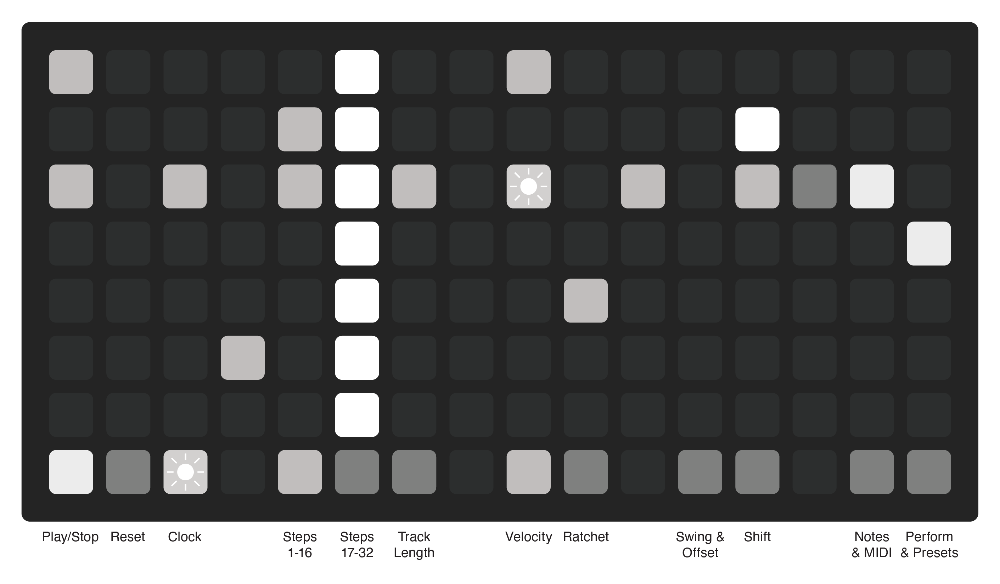
### Overview
Stepiii is an adaptable 7-track 32-step sequencer with live performance in mind. It uses an intuitive UI and workflow to allow for quick pattern adjustments, instant preset swaps, and on-device configuration. 

It is designed for drums, but can be equally useful for polyphonic sequences or a combination of instruments set up on different channels.

Each of the 7 tracks can have independently configurable length, velocity per step, ratchet per step, different amounts of swing, positive or negative offset, MIDI note and MIDI channel.

For performance, it has mutes, preset save and recall per track, tempo note repeat, and a cycling repeat.

## Play/Stop & Reset
**[A] Play/Stop**
This button starts and stops the sequencer. When clocking externally, this button only functions as a stop. The playhead will move across the grid for each track.

Shortcut:  
Holding **[A]** for 2 seconds will clear the sequence steps and reset all tracks to 16 steps. 

**[B] Reset**
This button resets each track back to the first step. I can be done in either clocking mode.
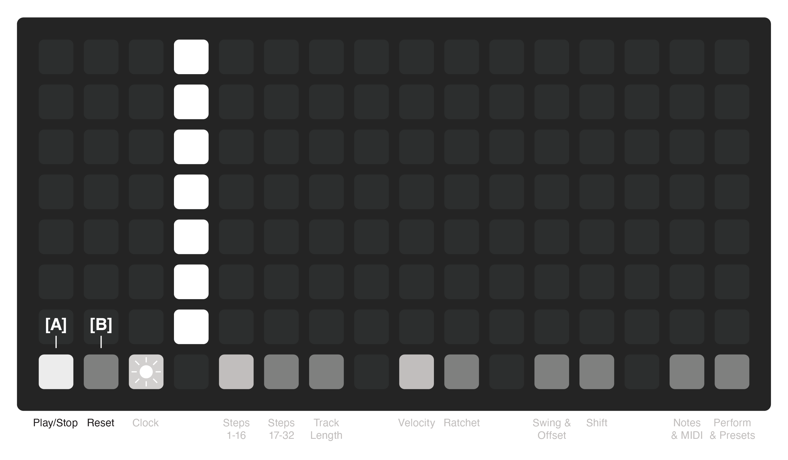

## Step Pages
**[C] Steps 1-16**
This button switches to show the first 16 steps of the sequencer.

**[D] Steps 17-32**
This button switches to show the second 16 steps of the sequencer.

**Page Follow**
The selected steps page stays visible. To have the steps follow the playhead from page to page, press the active page again.

**[E] Track Length**
This button acts as a toggle. Turning it on will prevent editing steps, but will show the end point for each track as a slow pulse. Each track can have a different length.

Shortcut:  
Holding **[E]** and pressing **[C]** resets all tracks to 16 steps.  
Holding **[E]** and pressing **[D]** resets all tracks to 32 steps.
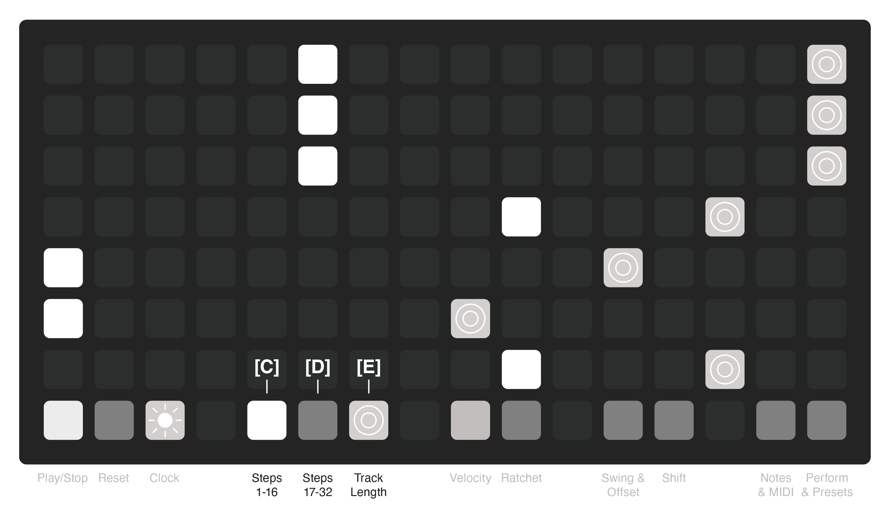

## Clock - Internal
**[F] Clock**
The clock button toggles clock page and blinks at the current tempo.

**[G] Tap Tempo**
The top left button is the tap tempo. Tap it ~4 times to set the internal tempo.

**[H] Internal Source**
This button selects the internal clock and the BPM displays the current tempo.

**[I] Increments**
The two sets of buttons next to the BPM display numbers are for increasing or decreasing the tempo.
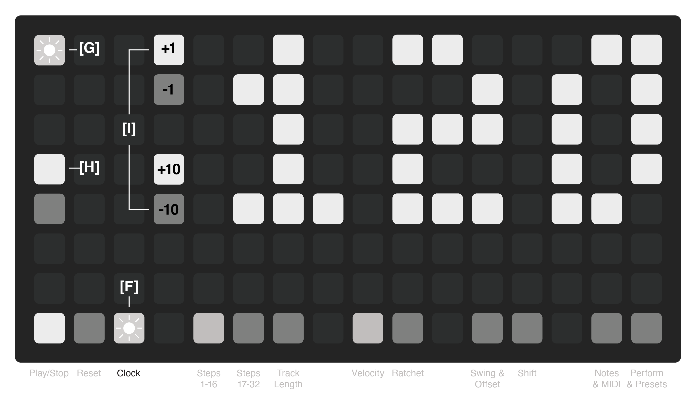

## Clock - External
**[J] External MIDI Source**
This button sets the clock to look for an external MIDI signal. It responds to start, stop, and reset signals. EXT is now showing instead of the BPM display.

If the clock is set back to internal after using an external, the internal clock will reflect the previously used external clock (approximate).

**[K] Clock Divider**
The external clock can be divided. The division global for all other time-based events.
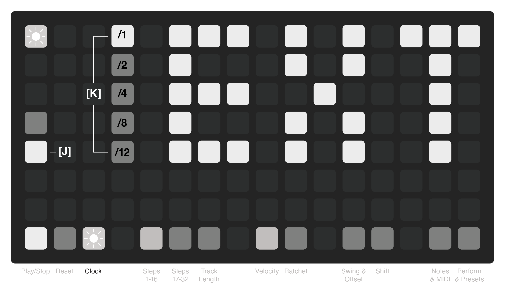

## Velocity & Ratchet
**[L] Velocity**
This button toggles through the velocity levels of the steps being entered on the track. It has four different levels, indicated by brightness:  
Dim = 32  
Low = 64  
Norm = 96  
Bright = 127

Steps are shown on the grid at their velocity brightness.

**[M] Ratchet**
This button toggles the ratchet option for the steps being entered on the track. A step with a ratchet will play two quick notes in the span of the same step with the first being a slightly lower velocity. If a step has a ratchet, the step blinks with the tempo.

Velocity and Ratchets can be applied to the same step.

Shortcut:  
Holding **[L]** or **[M]** and pressing an existing step will cycle through options of that step without removing it.
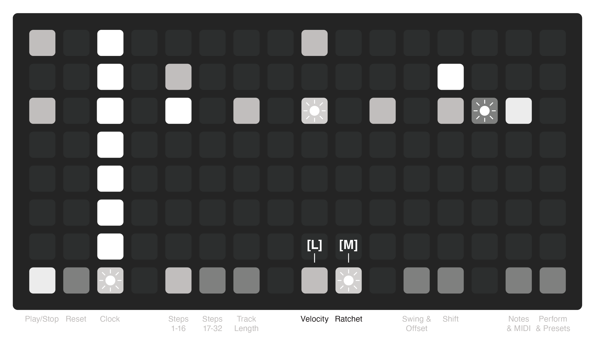

## Swing & Offset
**[N] Swing & Offset**
This button toggles the Swing and Offset page and shows the settings for each track. While each track can have independent swing and offset timings, they apply to all the steps in a track uniformly.

**[O] Track/Option Select**
The two columns of buttons on the left are for choosing which track and which option you are adjusting. The first column of buttons is for adjusting swing. The second column adjusts the offset.

**[P] Increments**
The two sets of buttons next to the number display are for increasing or decreasing the swing or offset.

Swing can be adjusted from 50 (no swing) to 75%.

Offset shifts all the steps on a track to play early or late. Offset adjustment can range from -50 to +50 milliseconds.
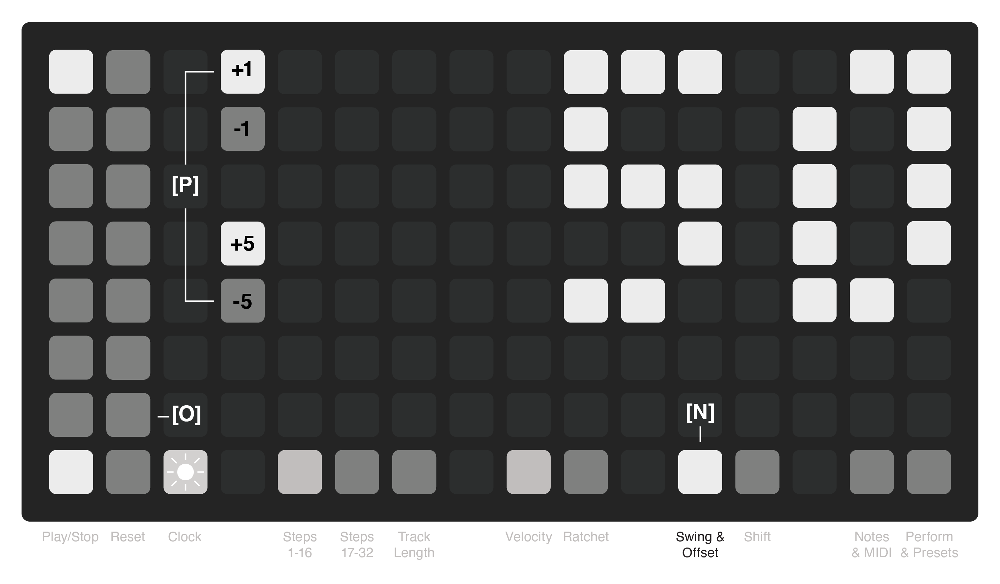

## Shift
**[Q] Shift**
This button toggles the shift feature that lets you move all the steps on a track left or right. While shift is toggled, press the button [R] in either the far left or right column to adjust the steps left or right on that particular track.

Steps at the end of a track will shift back around the start of the track and vice versa. 

The shift feature is only applied to the current track length, so steps outside of the current track length will not be shifted. Shift can also occur across track pages if the track length is longer than 16 steps.
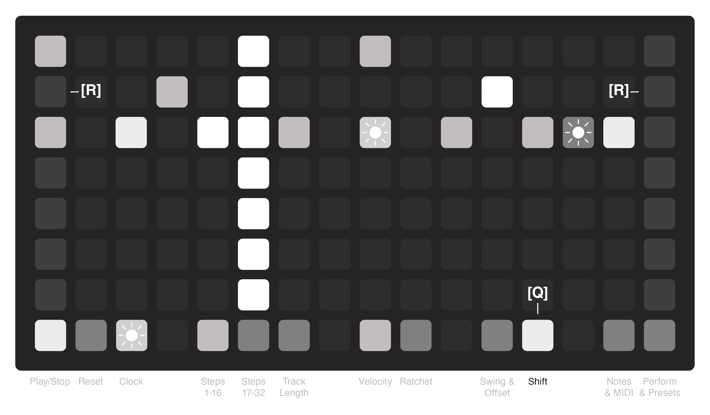

## Note & MIDI
**[S] Notes & MIDI**
This button toggles the Notes and MIDI page and shows the settings for each track. Each track can play a different MIDI note and be on a different MIDI channel.

**[T] Track/Option Select**
The two columns of buttons on the left are for choosing which track and which option you are adjusting. The first column of buttons is for adjusting MIDI note number. The second column adjusts the MIDI channel. These settings are saved with the per-track presets.

**[U] Increments**
The two sets of buttons next to the number display are for increasing or decreasing the note number or MIDI channel.

MIDI notes can range from 0 to 127 and MIDI channels can range from 1 to 16. The default channel is 10 and tracks 1-7 are 36, 38, 42, 46, 41, 49, and 51.
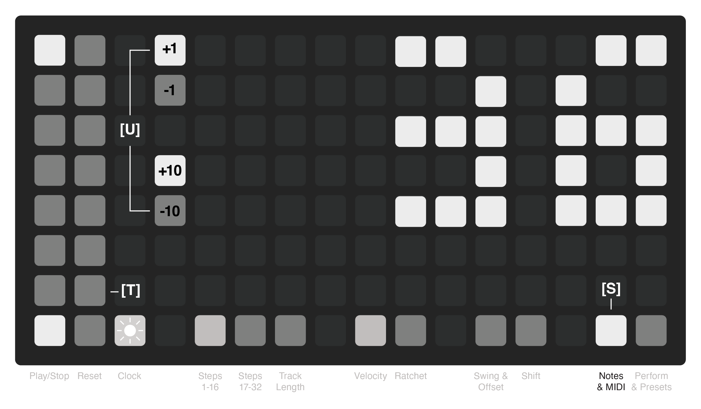

## Perform - Mute, Repeats & Cycle
**[V] Perform & Presets**
This button toggles the Perform and Presets page.

**[W] Mutes**
The far right column is a global mute for each track. A track is muted when its button is off and will play when lit.

**[X] Repeats**
The three columns of buttons is the repeats performance control. One button from each track can be held to have that note repeat at either 1/4, 1/8, or 1/16 notes. Mute states are respected and can be used to add silences even when held.

**[Y] Cycle**
This column acts as a 1/16 note repeat, but will cycle through the notes in the order they are held. Mute states are respected like cycles.

For both Repeats and Cycle, the repeats are tied to the BPM, swing, and offset for the track and begin on the next step to keep them in time.
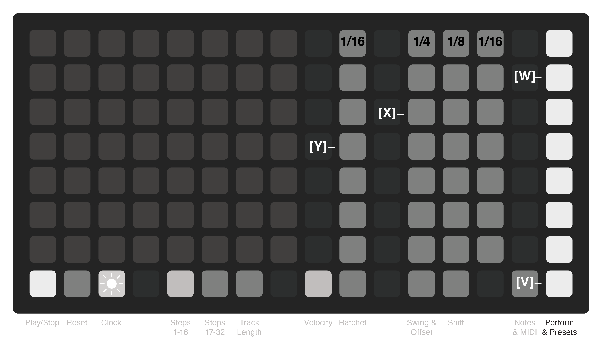

## Perform - Presets
**[Z] Preset Banks**
This grid represents the preset slots for the sequencer. Each track can store 8 presets. Slots with no saved preset are dim, and the active preset is lit brightly. Switching between presets is instant and can be used during performance.

Each preset stores the track’s steps, velocities, ratchets, mutes, length, swing, offset, MIDI note, and MIDI channel.

To save a preset, hold the slot button for 2 seconds until the slot blinks. Load a preset by tapping the desired button.

Presets are saved to the grid and can be recalled for later use. They are numbered based on the row and column. In diii you will see files that look like this:  
`pset_stepiii_11.lua`, `pset_stepiii_21.lua`, `pset_stepiii_31.lua`, etc...

There is another global preset numbered 100 that serves as a global state memory. It recalls your last used BPM and which presets were last loaded. It is updated when pressing any preset button. It looks like this in diii:  
`pset_stepiii_100.lua`
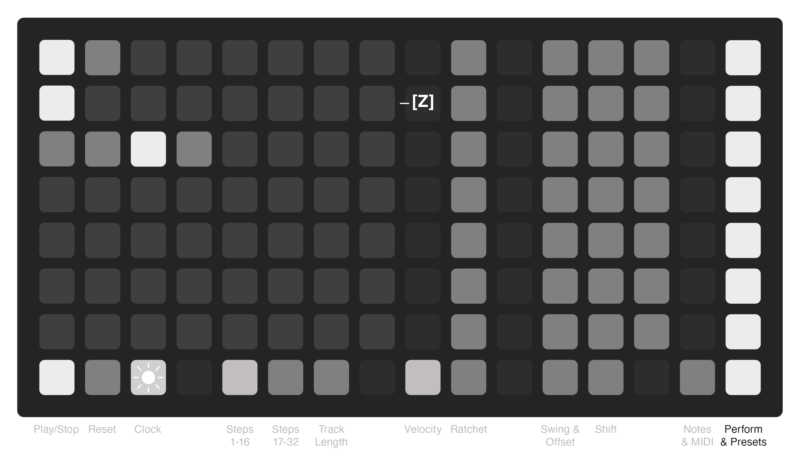
