# stepiii
A performance step sequencer for Monome Grid using iii

Current Version 2.2.0

[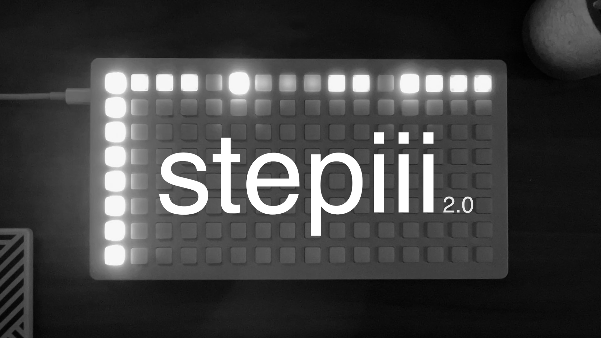](https://www.youtube.com/watch?v=aojaf-PSalU)

## Overview
Stepiii is an adaptable 7-track 64-step sequencer with live performance in mind. It uses an intuitive UI and workflow to allow for quick pattern adjustments, instant preset swaps, and on-device configuration. 

It is designed for drums, but can be equally useful for polyphonic sequences or a combination of instruments on set up on different channels.

Each of the 7 tracks can have independently configurable length, velocity per step, ratchet per step, different amounts of swing, positive or negative offset, MIDI note and MIDI channel.

For performance, it has mutes, preset save and recall per track, tempo note repeat, and a cycling repeat.
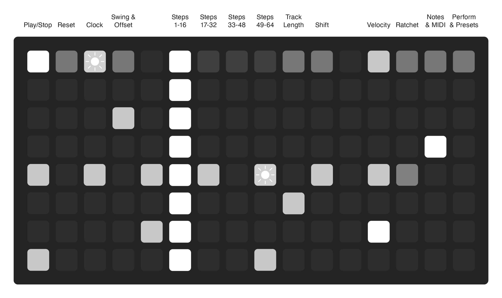

## Play/Stop & Reset
**[A] Play/Stop**  
This button starts and stops the sequencer. When clocking externally, this button only functions as a stop. The playhead will move across the grid for each track.

_Shortcut:_  
Holding **[A]** for 2 seconds will clear the sequence steps and reset all tracks to 16 steps. If you press the first button in a track while holding **[A]**, then just a single track will clear.

**[B] Reset**  
This button resets each track back to the first step. Reset works in either clocking mode and can be handled by external resets sent through MIDI.

**[C] Playhead**  
The playhead moves along the gate sequencer showing where the sequence is in time. Each track has an independent playhead that moves based on its own track length.

**[D] Track Row**
Each track has it’s own horizontal row to input steps. Each row can have up to 64 steps—16 on each of the four pages.
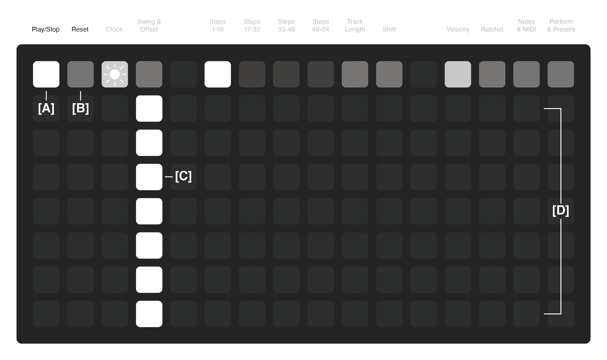

## Clock - Internal
**[E] Clock**  
The clock button toggles clock page and blinks at the current tempo.

**[F] Tap Tempo**  
This button is the tap tempo. Tap it ~4 times to set the internal tempo.

**[G] Internal Source**  
This button selects the internal clock and the BPM displays the current tempo.

**[H] Increments**  
The two sets of buttons next to the BPM display numbers are for increasing or decreasing the tempo.

**[I] Send MIDI Clock**
When this button is toggled, a 24ppqn clock is sent out to other devices as well as signals for start, stop, and reset.
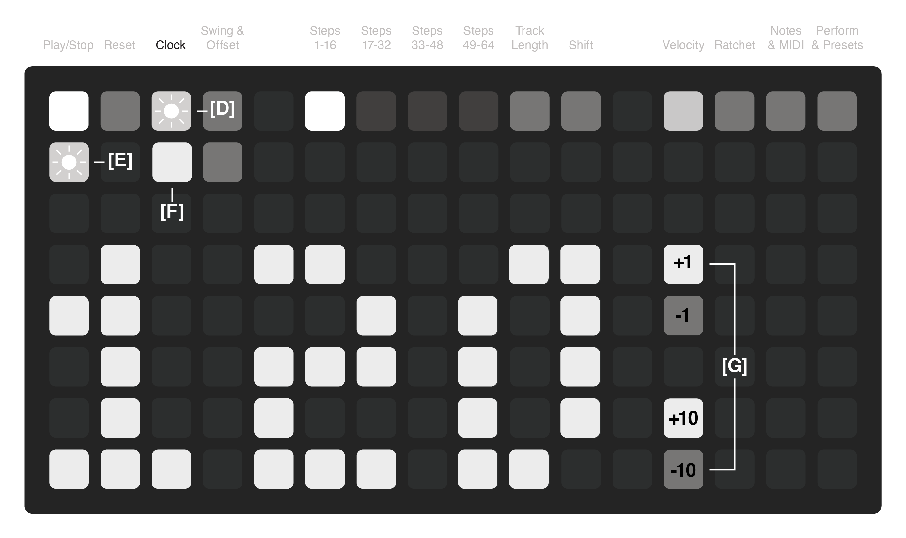

## Clock - External
**[J] External MIDI Source**  
This button sets the clock to look for an external MIDI signal. It responds to start, stop, and reset signals. EXT is now showing instead of the BPM display.

If the clock is set back to internal after using an external, the internal clock will reflect the previously used external clock (approximate).

**[K] Clock Divider**  
The external clock can be divided. The division is global for all other time-based events. The options are divide by:  
/1, /2, /4, /8, /16
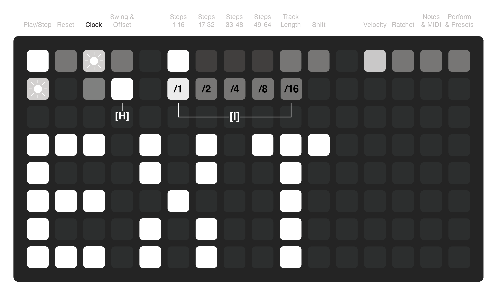

## Swing & Offset
**[L] Swing & Offset**  
This button toggles the Swing and Offset page and shows the settings for each track. While each track can have independent swing and offset timings, they apply to all the steps in a track uniformly.

**[M] Swing Track Select**  
This button column selects the track to edit for the swing value.

Swing can be adjusted from 25% to 75% with 50% being no swing. Swing set under 50% will cause the swung notes to arrive early and swing set over 50% will cause the swung notes to arrive late.

**[N] Offset Track Select**  
This button column selects the track to edit for the offset value.

Offset adjustment can range from -50 to +50 milliseconds to play the track early or late.

**[O] Increments**  
The two sets of buttons next to the number display are for increasing or decreasing the swing or offset.

_Shortcut:_  
Holding **[L]** and pressing an increment button will change all tracks to match the current value.
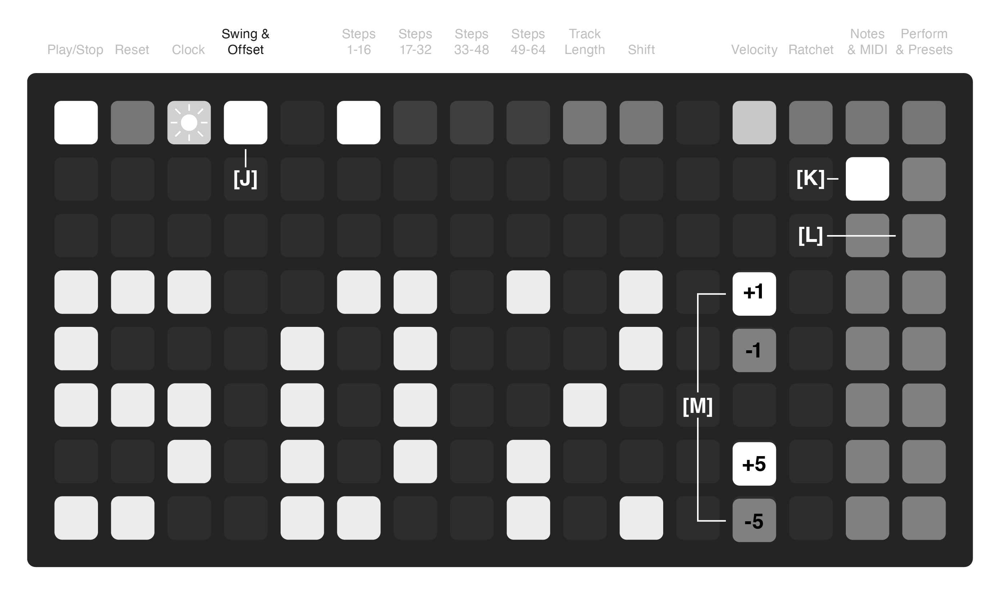

## Step Pages & Track Length
**[P] Pages**  
These buttons allow to switch between the four pages of steps in the sequencer. Each page has 16 steps for a total of 64. Inactive pages are dimly lit, and the currently active page is brightly lit.

_Shortcut:_  
Holding a page **[Q]** and pressing another page will copy the step data to the other page.

**Page Follow**  
The selected steps page stays visible. To have the steps follow the playhead from page to page, press the active page again.

**[Q] Track Length**  
This button acts as a toggle. Turning it on will prevent editing steps, but will show the end point for each track as a slow pulse. Each track can have a different length.

_Shortcut:_ 
Holding **[Q]** and pressing a column sets all tracks to that step length.  
Holding **[Q]** and pressing a page button **[P]** (1–4) will set the track length for all tracks to either 16, 32, 48, or 64 steps.
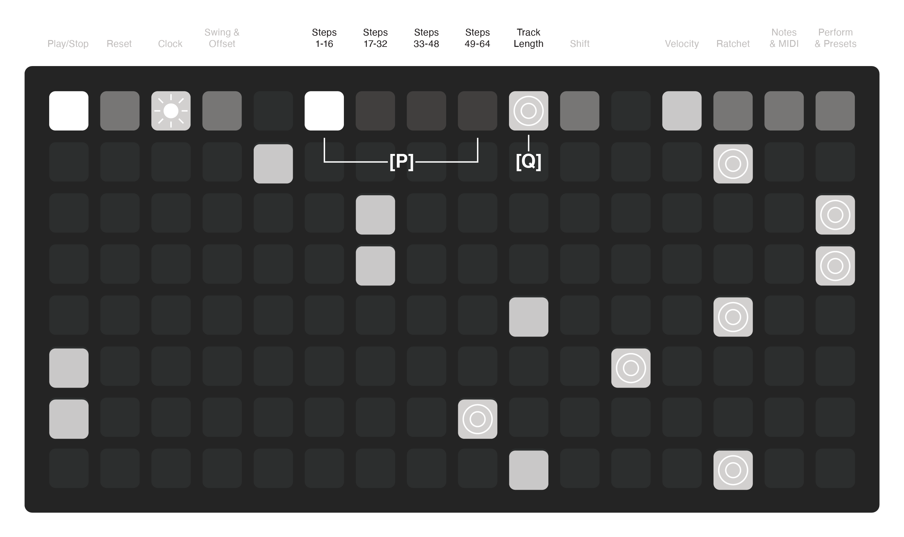

## Shift
**[R] Shift**  
This button toggles the shift feature that lets you move all the steps on a track left or right. 

**[S] Adjust Left/Right**  
While shift is toggled, press the button in either the far left or right column to adjust the steps left or right on that particular track.

Steps at the end of a track will shift back around the start of the track and vice versa. 

The shift feature is only applied to the current track length, so steps outside of the current track length will not be shifted. Shift can also occur across track pages if the track length is longer than 16 steps.
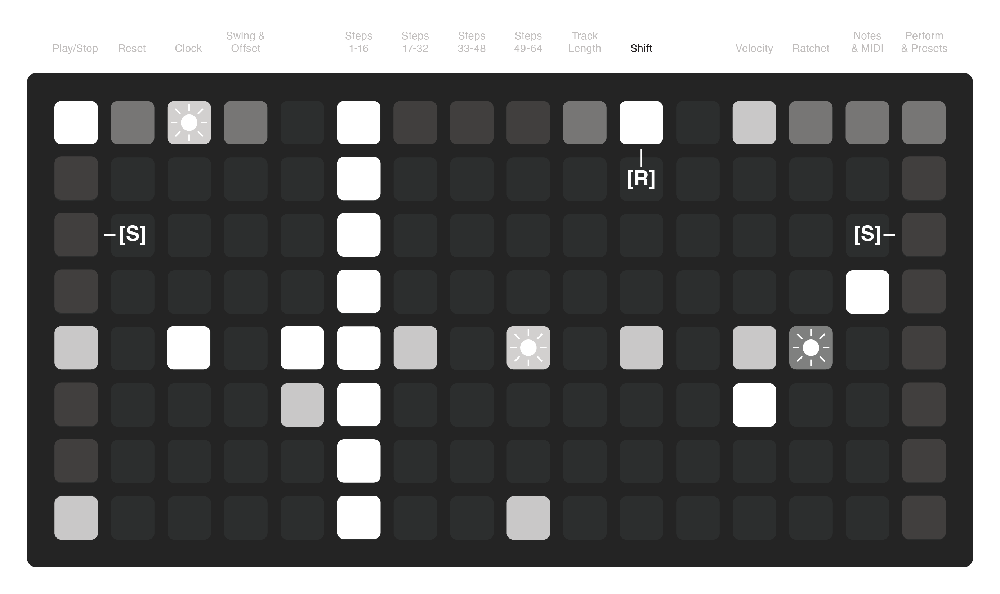

## Velocity & Ratchet
**[T] Velocity**  
This button toggles through the velocity levels of the steps being entered on the track. It has four different levels, indicated by brightness:  
Dim = 32  
Low = 64  
Norm = 96  
Bright = 127  
Steps are shown on the grid at their velocity brightness.

**[U] Ratchet**  
This button toggles the ratchet option for the steps being entered on the track. A step with a ratchet will play two quick notes in the span of the same step with the first being a slightly lower velocity. If a step has a ratchet, the step blinks with the tempo.

Velocity and Ratchets can be applied to the same step.

_Shortcut:_  
Holding **[T]** or **[U]** and pressing an existing step will cycle through options of that step without removing it. 
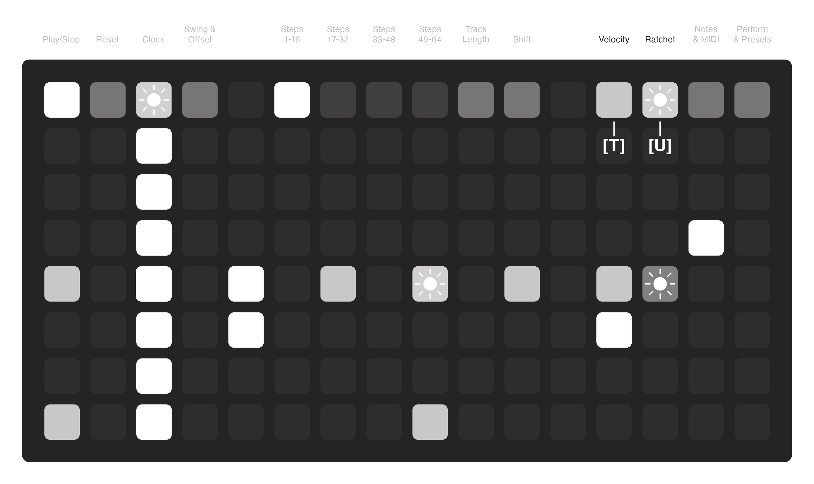

## Note & MIDI
**[V] Notes & MIDI**  
This button toggles the Notes and MIDI page and shows the settings for each track. Each track can play a different MIDI note and be on a different MIDI channel. These settings are saved with the per-track presets.

**[W] Note Track Select**  
This button column selects the track to edit for the note value.

MIDI notes can range from 0 to 127. The notes for tracks 1–7 are:  
49, 51, 46, 42, 38, 41, 36.

**[X] MIDI Track Select**  
This button column selects the track to edit for the MIDI channel value.

MIDI channels can range from ALL to 16. The default channel is 10.

**[Y] Increments**  
The two sets of buttons next to the number display are for increasing or decreasing the note number or MIDI channel.
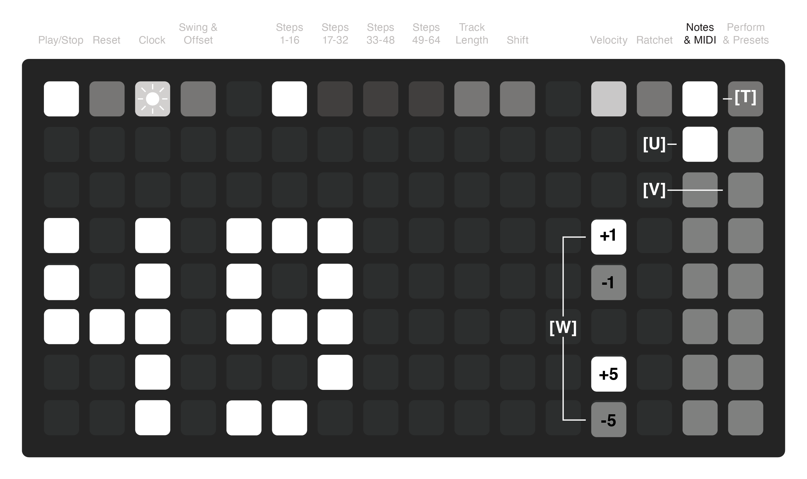

## Perform - Mute, Repeats & Cycle
**[Z] Perform & Presets**  
This button toggles the Perform and Presets page. 

_Shortcut:_  
Holding **[Z]** and pressing a mute or a preset will toggle all mutes or presets in a column.

**[AA] Mutes**  
The far right column is a global mute for each track. A track is muted when its button is off and will play when lit.

**[BB] Repeats**  
The three columns of buttons is the repeats control. One button from each track can be held to have that note repeat at either 1/4, 1/8, or 1/16 notes. Mute states are respected.

**[CC] Cycle**  
This column acts as a 1/16 note repeat, but will cycle through the notes in the order they are held. Mute states are respected like cycles.

For both Repeats and Cycle, the repeats are tied to the BPM, swing, and offset.
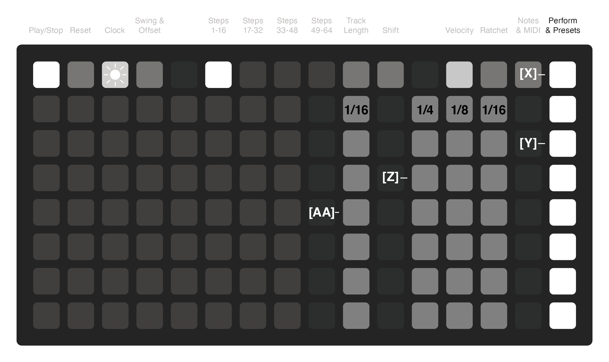

## Perform - Presets
**[DD] Preset Banks**  
This grid represents the preset slots for the sequencer. Each track can store 8 presets. Slots with no saved preset are dim, and the active preset is lit brightly. Switching between presets is instant.

_Shortcut:_  
You can save or load a whole column of presets by holding the **[Z]** button while selecting a preset from a column of **[DD]**.

Each preset stores the track’s steps, velocities, ratchets, mutes, length, swing, offset, MIDI note, and MIDI channel.

To save a preset, hold the slot button for 2 seconds until the slot blinks. Load a preset by tapping the desired button.

Presets are numbered based on the track and column. In diii you will see files that look like this:  
`pset_stepiii_11.lua`

Another global preset:  
`pset_stepiii_100.lua`  
serves as a global state memory. It recalls your last used BPM and which presets were last loaded. It is updated when pressing any preset button.
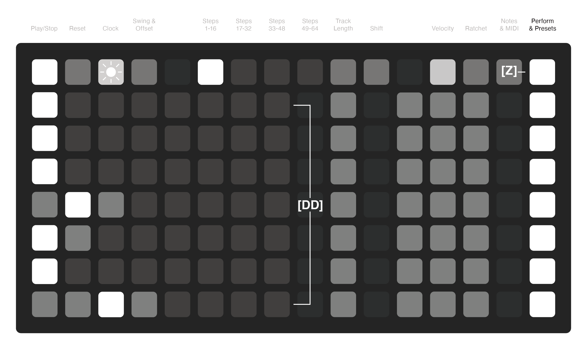
